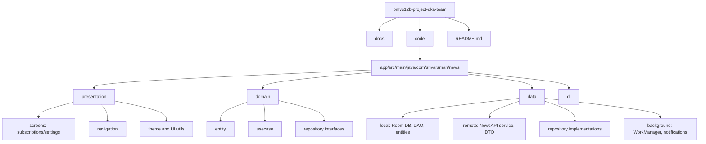

# Диаграмма файлов приложения

## Диаграмма структуры

## Описание ключевых файлов и папок

- `code/app/src/main/java/com/shvarsman/news/presentation`  
  UI-слой на Jetpack Compose: экраны, `ViewModel`, навигация.

- `code/app/src/main/java/com/shvarsman/news/domain`  
  Бизнес-слой: сущности (`Article`, `Settings`), use case, интерфейсы репозиториев.

- `code/app/src/main/java/com/shvarsman/news/data`  
  Источники данных и реализации репозиториев (сеть, БД, фоновые задачи).

- `code/app/src/main/java/com/shvarsman/news/data/local`  
  Room-модели, DAO и `NewsDatabase`.

- `code/app/src/main/java/com/shvarsman/news/data/remote`  
  API-клиент `NewsApiService` и DTO для работы с NewsAPI.

- `code/app/src/main/java/com/shvarsman/news/data/background`  
  `RefreshDataWorker` и логика уведомлений.

- `code/app/src/main/java/com/shvarsman/news/di/DataModule.kt`  
  Конфигурация зависимостей через Hilt.

- `docs`  
  Страницы Wiki/GitHub Pages с проектной документацией.
