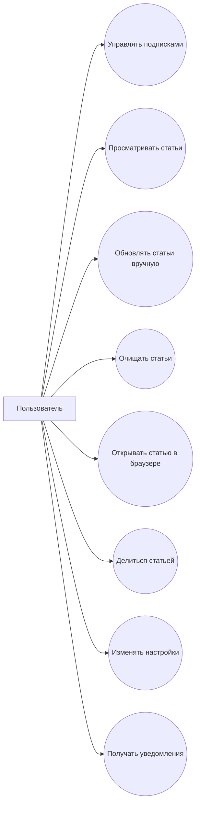

# Функциональные требования

## Основные требования

1. Пользователь может добавить подписку на тему новостей.
2. Пользователь может удалить подписку.
3. Пользователь может выбрать активные темы для фильтрации статей.
4. Приложение загружает новости по выбранным подпискам.
5. Пользователь может вручную обновить новости.
6. Пользователь может очистить локальный список статей.
7. Пользователь может открыть оригинальную статью в браузере.
8. Пользователь может поделиться ссылкой на статью.
9. Пользователь может настроить язык поиска новостей.
10. Пользователь может настроить интервал фонового обновления.
11. Пользователь может включить/выключить уведомления о новых статьях.
12. Пользователь может включить/выключить режим обновления только по Wi-Fi.

## Диаграмма Use Case

## Текстовые сценарии

### UC-01: Добавление подписки

- **Предусловие:** пользователь находится на главном экране.
- **Основной поток:**
  1. Вводит тему в поле ввода.
  2. Нажимает кнопку добавления подписки.
  3. Приложение сохраняет тему в локальной базе.
  4. Новая подписка отображается в списке.
- **Постусловие:** тема доступна для выбора при фильтрации статей.

### UC-02: Получение и просмотр новостей

- **Предусловие:** существует хотя бы одна подписка.
- **Основной поток:**
  1. Пользователь выбирает одну или несколько тем.
  2. Нажимает обновление или ожидает фонового обновления.
  3. Приложение запрашивает данные из NewsAPI.
  4. Приложение сохраняет статьи и отображает их списком.
- **Постусловие:** пользователь видит актуальные статьи по выбранным темам.

### UC-03: Изменение настроек

- **Предусловие:** пользователь открывает экран настроек.
- **Основной поток:**
  1. Выбирает язык поиска.
  2. Выбирает интервал обновления.
  3. Включает или отключает уведомления.
  4. Включает или отключает режим Wi-Fi only.
  5. Приложение сохраняет настройки в DataStore.
- **Постусловие:** новые параметры применяются к фоновому обновлению и UI.
